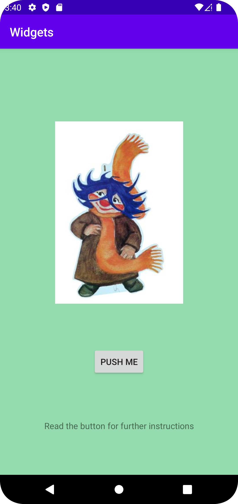

# Rapport

Inuti activity_main.xml har jag lagt till en ny constraintlayout där jag sedan lade till tre olika widgets. Här valde jag att använda mig av en textView, en imageView och en button. I min constraintlayout använde jag mig av attributmenyn för att ändra dess bakgrundsfärg till en grön nyans. I mina widgets har jag lagt till constraints för att testa olika positioner på dem. I imageViewn började jag med att lägga in en placeholder-bild för att sedan ta en screenshot från internet i png som jag sedan importerade som drawable i android studio och satte som image. I bilden ändrade jag dess storlek och gav en contentdescription. Efter det har jag ändrat constraints mellan widgetarna för att ändra deras positioner gentemot varandra för en mer estetisk layout. Jag har även använt mig av ett stort antal commits till github.


```
<ImageView
            android:id="@+id/imageView3"
            android:layout_width="300dp"
            android:layout_height="300dp"
            android:contentDescription="his logo"
            app:layout_constraintBottom_toBottomOf="@id/button"
            app:layout_constraintEnd_toEndOf="parent"
            app:layout_constraintStart_toStartOf="parent"
            app:layout_constraintTop_toTopOf="parent"
            app:srcCompat="@drawable/plupp" />
```
I kodsnutten syns koden för min imageview. Där har jag satt ett namn/id som kan användas för att referera till bilden när man exempelvis ska sätta constraints. Sedan har jag satt bildens brädd och höjd. En contentdescription behövdes för att beskriva bilden och sedan använder jag mig av olika positioneringsconstraints för att placera bilden i min layout gentemot, i det här fallet, knappen och parentramen. Slutligen hänvisar srcCompat till den specifika bilden jag vill visa i imageviewn.


